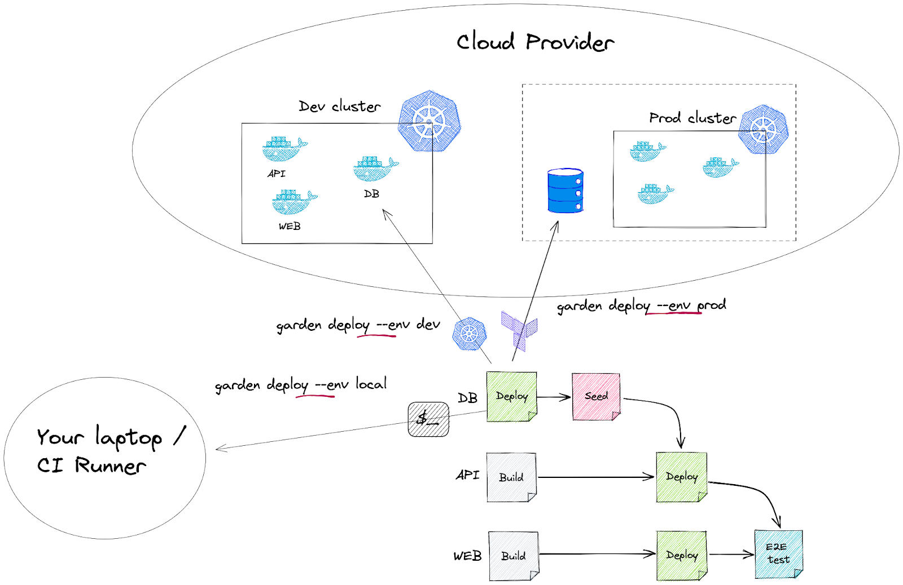

# How does Garden work?

This section describes how Garden works and the idea behind developing it. Check out this video to get an overview of Garden Core's capabilities: 



## **The Stack Graph**

The Stack Graph is **an executable blueprint that helps run the system using a single command**. The Stack Graph is pluggable, hence how these actions (the graph nodes) run depends on the plugins used.
Below is a representation of how a YAML manifest is resolved into a graph. 


## **Garden Core**
**Garden Core** is a powerful standalone binary that can be executed from the CI or from a developer’s machine. It allows you to codify a complete description of your stack using intuitive YAML declarations, making your workflows **reproducible** and **portable**.

It is based on the idea that all DevOps workflows can be completely described in terms of four actions, listed below:

- **build**
- **deploy**
- **test**
- **run** (to run ad-hoc tasks)

> **Note**:
The actions are interdependent across the component of the system.

Below is the YAML manifest of a three tier web application:

```yaml
# This config is in a single file for convenience.
# You can split it into multiple files and even across repositories!
kind: Deploy
name: db
type: helm
spec:
  chart:
    repo: https://charts.bitnami.com/bitnami
---
kind: Run
name: db-init
type: container
dependencies: [deploy.db]
---
kind: Deploy
name: api
type: kubernetes
build: api
dependencies:
  - run.db-init
spec:
  files: [api/manifests]
---
kind: Deploy
name: web
type: kubernetes
build: api
dependencies:
  - deploy.api
spec:
  files: [web/manifests]
---
kind: Test
name: e2e
type: kubernetes-exec
dependencies: [deploy.api]
spec:
  args: [python, /app/test.py]
```

Garden collects all these descriptions (can be across multiple repositories) into the Stack Graph and leverages your existing configuration (Helm charts, Kubernetes manifests, Dockerfiles, Terraform files, etc) and infrastructure to execute the graph **in any environment**. Below is a visual of how Garden executes the graph. 


## **The Garden CLI**

Each of the four actions (build, deploy, test, and run) has a corresponding command that you can run with the Garden CLI.

For example, to create a preview environment on every pull request, add the following to your CI pipeline:

```yaml
garden deploy --env preview
```

To run an end-to-end test from their machine as they code:

```yaml
garden test --name e2e
```

Garden has a special mode called **sync mode** which live reloads changes to your running deploys ensuring **blazing fast feedback while developing**. To enable it, simply run:

```yaml
garden deploy --sync
```

There are many other utility commands to fetch logs, exec into services, publish images, etc.

With the help of the Stack Graph, these workflows stay consistent irrespective of how the stack scales.


## **Garden Cloud**

Garden Cloud is a web platform built on top of Garden Core. It adds features for teams using Garden Core such as user and secret management, log streaming, interactivity, and much more.

To learn about Garden Cloud, check out our [website](https://garden-io.webflow.io/pricing) or the official [Cloud documentation](https://cloud.docs.garden.io/).

## **Plugins**

By design, Garden is pluggable and supports a variety of providers and action types. You can choose from these providers based on your existing set-up.
The plugins determine the course of a given Garden command. Each action (or node) in the graph belongs to a plugin, and the plugin is responsible for executing the action.

For example, you can:
- Use the Kubernetes plugin to install Helm charts and apply your Kubernetes manifests and the Terraform plugin to provision the infrastructure.
- Mix and match platforms in the same project by using custom plugins for serverless runtimes.
- Streamline workflows using language-specific plugins.
- Leverage Garden's caching and scan-during-runtime feature using security plugins.

Check out how certain common plugins, like [Kubernetes](../k8s-plugins/about.md) and [Terraform](../terraform-plugin/about.md) work.

> Tip:
Plugins ensure that Garden is future proof and can grow with your stack. This eradicates the need to retool or disrupt developer workflows for the “next big thing”.

## **Caching**

One of the most important features of Garden is its smart caching abilities. Owing to the graph structure, Garden determines the version of any element of your system, while accounting for upstream dependencies. This ensures that the same image or same test need not be executed more than once.

If the end-to-end service test passes, Garden determines that the code hasn't changed, thereby not to run the test again. However, if any of the upstream services under test are modified, Garden captures the change and re-runs the test. Garden ensures that the tests are executed when required, thereby ramping up the speed of execution of your pipelines by orders of magnitude.

## **Templating**

Another essential feature is Garden's robust templating engine that allows you to define variables and enable (or disable) parts of the graph depending on your environment. This makes your configuration dynamic and adaptable.
For example, you might deploy a development database with the Kubernetes plugin in development but use the Terraform plugin to provision a managed database in production.
This flexibility allows you to codify your entire stack and utilize the same workflow for different environments or stages of software delivery, thereby making your workflows more consistent and reusable. 



## Conclusion

In summary, Garden empowers you by providing a flexible and declarative approach to managing DevOps workflows. It facilitates reproducibility and portability by allowing you to define your stack in YAML. Garden Core's features make your stack description more versatile and your workflows consistent across different environments.

For any further assistance or questions, feel free to reach out to our support channels.

Happy Gardening!
