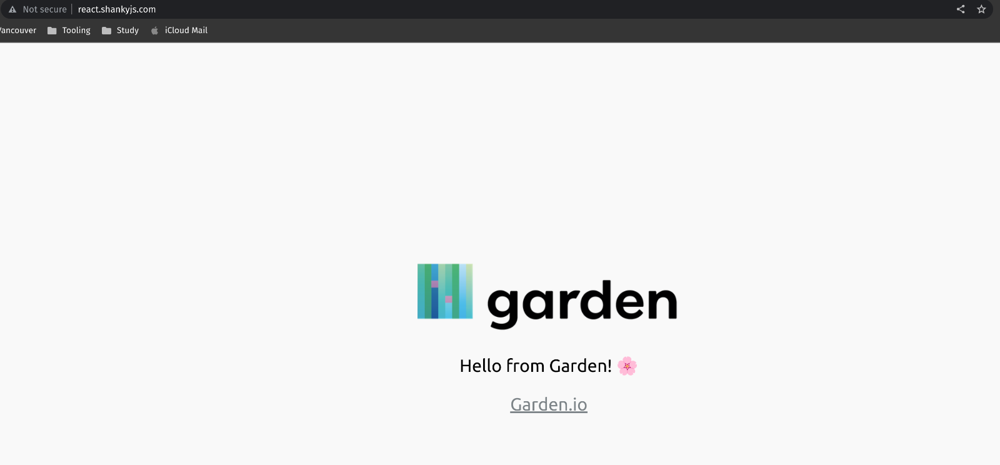
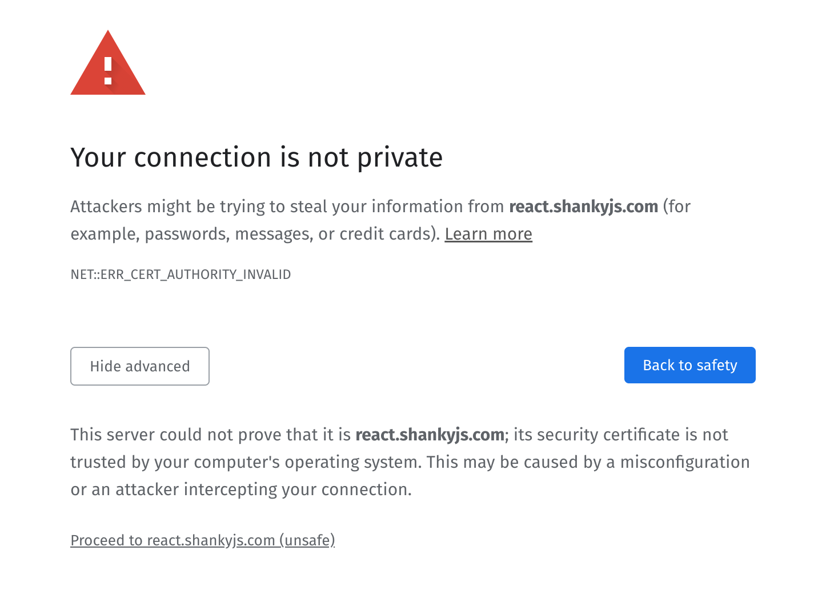
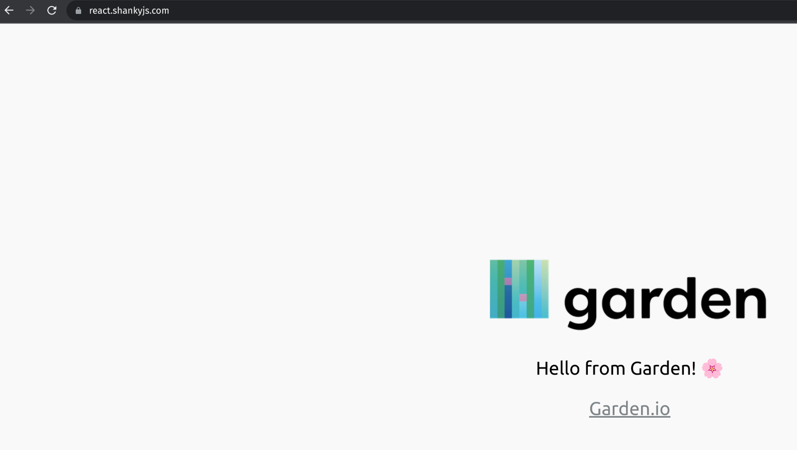

# Deploy cert-manager and ExternalDNS with Garden

Creating and managing DNS records and TLS certificates can be expensive for engineering teams.

This example uses cert-manager, a popular Kubernetes add-on that automates the management and issuance of TLS certificates.

Additionally, to enable dynamic DNS provisioning, ExternalDNS is a great tool that allows for automatic registration of Kubernetes services and ingress objects into a Cloudflare DNS zone.

Both tools combined can improve the automation and reliability of the infrastructure.

## About

This project deploys a small React service in a Kubernetes Cluster and exposes it to an Nginx ingress with HTTPs by using the following Kubernetes Operators:

| service       |   version  |
|---------------|------------|
| cert-manager  |  v1.11.0   |
| external-dns  |   v6.13.3  |

In this example, we are utilizing the `container` and `helm` modules supported by Garden, providing automation and security to the process.

### Folder structure

In the following block, you will find the structure we followed for this cert-manager-ext-dns example.

````bash
├── charts
│   ├── cluster-issuers <- Creates cluster-issuers certificate.
├── frontend <- Deploys a React Application to the environment
│   ├── Dockerfile
│   ├── garden.yml
│   ├── node_modules
│   ├── package.json
│   ├── package-lock.json
│   ├── public
│   └── src
├── garden.yml <- Contains the module config for external-dns & cert-manager
├── project.garden.yml <- Contains the project configuration/env-vars.
└── README.md
````

## Requirements

- A Kubernetes cluster with the correct Security Groups/Firewall rules to allow HTTP/HTTPS.
- A domain name you own, for example, example.com.
- An account in Cloudflare with at least one DNS-hosted zone.
  - You will also need a Cloudflare API Token with the permissions defined in this example.
  - 🚨 Make sure to use an API Token, not an API Key (or Global Key). This example uses a Cloudflare API Token specifically.
- To have brief prior knowledge of cert-manager and ExternalDNS.
- A Docker Registry (Docker Hub, etc.) and a Kubernetes secret with the credentials of the registry.

## Instructions

To run this project, export the following variable in your ENV.

````bash
export CF_API_TOKEN=your-cf-API-token
````

Then set the required variables in your [project.garden.yml](./project.garden.yml), use the following block as an example for the variables:

````bash
variables:
  # Variables for Docker Registry
  registryHostname: docker.io
  registryNamespace: your-username-namespace
  # Variables for Kubernetes
  DEFAULT_NAMESPACE: default
  # Cert-Manager variables
  CERT_MANAGER_INSTALL_CRDS: true
  GENERATE_PROD_CERTS: false
  GENERATE_STG_CERTS: false
  # External-DNS variables
  CF_DNS_PROVIDER: cloudflare
  CF_DOMAIN: [ your-dns-zone.com ]
  CF_UPDATE_STRATEGY: sync
  CF_EMAIL: your-email@something.com
  CF_PROXIED: false
````

Also, set your Kubernetes context.

````bash
kubectl config get-contexts
kubectl config current-context # Copy the name of the context
````

After getting your context name, change the `context` field in your [project.garden.yml](./project.garden.yml) file.

For the `deploymentRegistry` and `imagePullSecrets` fields, you must have a Docker Registry (prerequisite #5).

If you already have a Docker registry on Docker Hub or Quay, create a secret with your credentials using the following command:

```bash
kubectl create secret docker-registry regcred \
  --docker-username=user \
  --docker-password=password \
  --docker-email=docker-email@email.com \
  --docker-server=your-docker-server-url
```

Note: *If you are using Docker Hub*, `--docker-server` should be: `https://index.docker.io/v1/`

Or, you can also follow this awesome guide from the official [Kubernetes documentation](https://kubernetes.io/docs/tasks/configure-pod-container/pull-image-private-registry/). Make sure to name your secret `regcred` and keep it in the `default` namespace.

If you decide to set up the secret with a different name make sure to update it in the `imagePullSecrets` configuration.

After setting these values, deploy the configuration for the first time.

````bash
garden deploy --yes
Deploy 🚀

━━━━━━━━━━━━━━━━━━━━━━━━━━━━━━━━━━━━━━━━━━━━━━━━━━━━━━━━━━━━━━━━━━━━━━━━━━━━━━━━
🌍  Running in namespace default in environment prod
━━━━━━━━━━━━━━━━━━━━━━━━━━━━━━━━━━━━━━━━━━━━━━━━━━━━━━━━━━━━━━━━━━━━━━━━━━━━━━━━

✔ providers                 → Preparing environment... → Cached
   ✔ providers                 → Getting status... → Cached
      ℹ Run with --force-refresh to force a refresh of provider statuses.
   ✔ graph                     → Resolving 11 modules... → Done
   ✔ kubernetes                → Configuring... → Ready
   ℹ Run with --force-refresh to force a refresh of provider statuses.
✔ graph                     → Resolving 4 modules... → Done
✔ cluster-issuers           → Building version v-7e466ae4e3... → Done (took 0 sec)
✔ cert-manager              → Building version v-0b43e69fd6... → Done (took 0.6 sec)
✔ external-dns              → Building version v-ec953ac304... → Done (took 1.1 sec)
✔ react-app                 → Getting build status for v-8323dd9f4c... → Already built
✔ cert-manager              → Deploying version v-010a92e8da... → Done (took 37 sec)
   ℹ cert-manager              → Resources ready
✔ external-dns              → Deploying version v-11221c2d8c... → Done (took 12.9 sec)
   ℹ external-dns              → Resources ready
✔ cluster-issuers           → Deploying version v-e67a273f4c... → Already deployed
✔ frontend                  → Deploying version v-ac87f68175... → Already deployed
   Ingress: <http://react.shankyjs.com>

Done! ✔️
````

After the deployment, Garden deploys a fancy landing page without a certificate🎉.



To generate the certificates, switch `GENERATE_STG_CERTS` from false to true. This action allows Garden to deploy the certificates.

⚠️ As a recommendation, use `Letsencrypt staging` certificates for experimenting with this example; API limits and quotas from production Let's Encrypt are lower and not intended to generate excessive amounts of certificates in a short span [Additional information](https://letsencrypt.org/docs/staging-environment/).

Deploy again to generate the staging certificates with `garden deploy --yes`.

````bash
kubectl get cert
NAME           READY   SECRET         AGE
staging-cert   True    staging-cert   4m23s
````

The staging certificate got created, now uncomment the `tlsCertificates` block in your [project.garden.yml](./project.garden.yml) file.

````yaml
...
kaniko:
  namespace: null
tlsCertificates: # <------ Uncomment this block
  - name: staging-cert
    secretRef:
      name: staging-cert
...
````

Deploy and refresh your browser.

A message stating "your connection is not private" means that certificate got exposed to the NGINX ingress. Browsers do not trust staging certificates, hence the alert.



To generate the production certificates, turn `GENERATE_PROD_CERTS` to true and re-deploy the example, waiting for the new certificate to be ready.

````bash
kubectl get cert
NAME              READY   SECRET            AGE
production-cert   True    production-cert   116s
staging-cert      True    staging-cert      24m
````

After generating the production certificate, update the tlsCertificates to reference it, then perform a deployment.

````yaml
tlsCertificates:
  - name: production-cert
    secretRef:
      name: production-cert
````

And voilà! We can now see the desired 🔒️ on our website. If you've made it this far, the NGINX ingress controller is correctly utilizing your certificate, and we have a valid HTTPS endpoint using the Production certificate 🕺.



If you have any issues, find a bug, or something is not clear from the documentation, please don't hesitate to open a new [GitHub issue](https://github.com/garden-io/garden/issues/new?template=BUG_REPORT.md) or ask us questions in [our Discord community](https://discord.gg/UetZGUKhNx).
